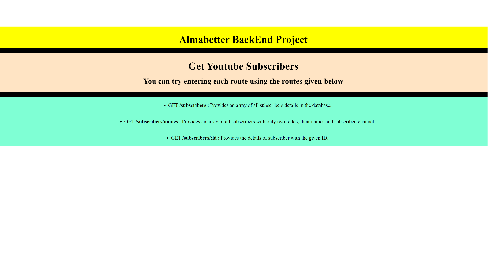
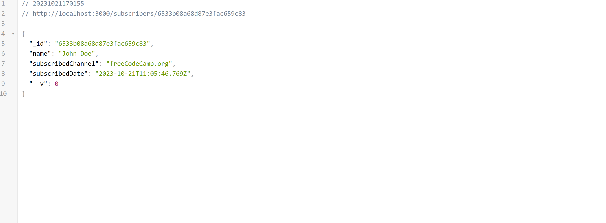

# AlmaBetter Backend Project 

## Get_Youtube_Subscribers
This is a simple backend project that contains a RESTful API for getting information about YouTube channel subscribers. The project is developed with Node.js and Express, and the database used for managing the subscriber data is MongoDB. The subscriber's data consists of fields such as their ID, Names, Subscribed Channels, and Subscription Date.

The API has several endpoints that let users get data in JSON format, such as an endpoint that returns a list of all subscribers, an endpoint that returns a list of names and subscribed channels for each subscriber, and an endpoint that returns information about a subscriber based on their ID.

## API Endpoints 
1. **"/ "** -> This default route will render the "index.html file" when the app launches. http://localhost:4001/


2. **"/subscribers "** -> This endpoint returns an array of all subscribers in the database. http://localhost:4001/subscribers


3. **"/subscribers/names "** -> This endpoint returns an array of subscribers with only two fields, their name and subscribed channel. http://localhost:4001/subscribers/names


4. **"/subscribers/:id "** -> This returns the details of subscriber whose Id is provided in endpoint. http://localhost:4000/subscribers/:id



## Application Folder Structure
1. [src/app.js] -> For handling requests and responses.

2. [/index.js] -> To connect and start the server.

3. [src/createDatabase.js] -> To create database on MongoDB.

4. [src/data.js] -> Data that has to be connnected to a database.

5. [src/models/subscribers.js] -> For the schema.
   
6. [src/index.html] -> The home page for the application.
```
├── src/
│   ├── app.js
│   ├── createDatabase.js
│   ├── data.js
│   ├── index.html 
│   └── models/
│       ├── subscribers.js
├── index.js   
├── {} package-lock.json
└── {}package.json
```

## Installation 

You'll need to have **Node.js** and **MongoDB** installed on your computer in order to begin working on the project. 

Once installed, Clone this repository to your **local** machine.

Install the required dependencies as mentioned below by using **npm install <packageName>**.

Start the server by **nodemon index.js**

## Dependencies
Following dependencie are needed to run this application: 

1. express

2. mongoose

3. nodemon

## Deployment


## Links

- Github URL: [Github](https://github.com/Amitk2108/youtubesub)
- Live Site URL: [Live](https://youtubesub.vercel.app/)

## Author

- Website - [Amit](https://amitpro.netlify.app/)
- LinkedIn - [@amit-ib](https://www.linkedin.com/in/amit-ib/)


